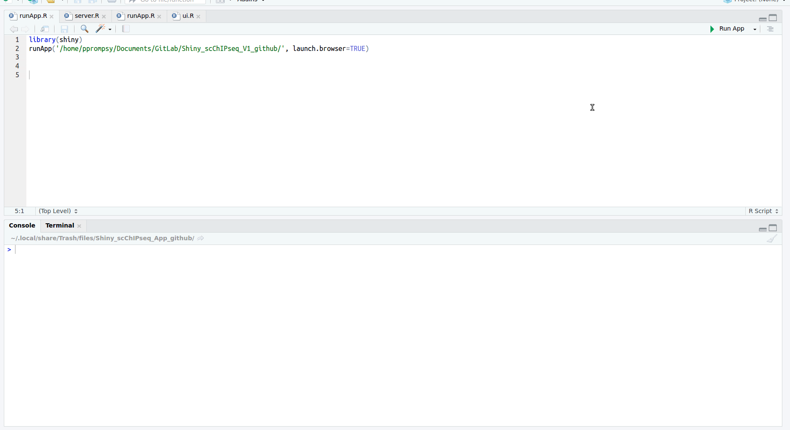

# ChromSCape: Analysis of single-cell ChIP-seq data in a Shiny App
## What is ChromSCape ?

ChromSCape - Single-Cell Chromatin Landscape profiling - is a ready-to-launch user-friendly Shiny App for analysis of single-cell ChIP-seq datasets from count matrices to differential analysis & gene set enrichment analysis. ScChIPseq data can be produced using experimental protocol described in Grosselin et Al. (https://www.nature.com/articles/s41588-019-0424-9). The user should input one or many count matrices (in .txt or .tsv format). 

Note : Single-cell ATAC seq or scDNA-seq data under the same format should also work, as of same nature than scChIPseq data, but the application has not been tested for this type of data.

## Launch the App 

First download the repository in the location of your choice, either with `git clone https://github.com/vallotlab/ChromSCape.git ChromSCape` or by clicking on 'Clone or Download' -> 'Download ZIP' and unzip.

Go to the directory & modify the runApp.R script to the path to the directory & save file:
```
library(shiny)
runApp('path/to/ChromSCape', launch.browser=TRUE)
```

Make sure to have all the libraries required (see ##Requirements) and start the App :

```
Rscript runApp.R
```
## Walkthrough of the App through screencast

### 1 - Filtering, vizualiation & correlation


### 2 - Clustering, differential analysis & gene set enrichment


## Sample datasets

The dataset from Grosselin et al. are PDX- triple negative breast cancer tumours resistant or not to chemotherapy (respectively HBCx_22 & HBCx_95).
Download the dataset of interest from GEO :https://www.ncbi.nlm.nih.gov/geo/query/acc.cgi?acc=GSE117309. To run the app up to the differential analysis step, you need the count matrices. The peak calling and gene set enrichment parts require BAM files (available at https://figshare.com/s/fb04c2b17b234aa9d5eb). 

## Output

The app automatically creates a directory **datasets** in which a new directory is created for each analysis with a different input name. Inside that directory are created a directory for each part of the analysis, containing RData and figures.
  
## Other

The Gene Set Enrichment Analysis is based on MSIG database (http://software.broadinstitute.org/gsea/msigdb).

## Docker version 

Docker is a software platform that allows you to build, test, and deploy applications quickly. Docker packages software into standardized units called containers that have everything the software needs to run including libraries, system tools, code, and runtime. Using Docker, you can quickly deploy ChromScape without any need for requirements library and programm installation.

First, go to the branch "docker" of this repository, download or clone this repository on your local in the directory of your choice (e.g. /path/to/ChromSCape_docker_app/ ).
Then create a data folder (e.g. /path/to/Data_ChromScape/ ) that will be linked to the docker environment, and where you will be able to retrieve all of your data after closing the application.

### Change ownership of the data folders 
In order for the docker container to be able to write into the data folder you created, as well as the application folder for temporary files, the ownership of your directory must be changed for the container user 999 (shiny user) :

On Linux / Mac OS:
```
sudo chown -R 999:999 /path/to/Data_ChromScape/
sudo chown -R 999:999 /path/to/ChromSCape_docker_app/
```

Then, download & install Docker (https://hub.docker.com/?overlay=onboarding).

Then open the terminal and run the following command, replacing the path to application & data folder by your own :
```
sudo docker run --rm  -p 3838:3838  -v /path/to/ChromSCape_docker_app/:/srv/shiny-server/ -v /path/to/Data_ChromScape/:/var/lib/shiny-server/ -u shiny:shiny pacomito/chromscape:latest
```
Open a browser and go to http://localhost:3838/, you should see the application running.

If there is an error as follow:

```
[2019-12-16T14:53:23.724] [ERROR] shiny-server - Bookmark state directory creation failed: /var/lib/shiny-server/bookmarks
[2019-12-16T14:53:23.726] [WARN] shiny-server - ENOENT: no such file or directory, stat '/var/lib/shiny-server/bookmarks
```

You must create the bookmarks/shiny directory first inside /path/to/Data_ChromScape/ : 

```
sudo mkdir -r /path/to/Data_ChromScape/bookmarks/shiny/
```
Note that the peak calling is disabled for now in the docker application.

## Requirements

Before the first time you run the App, launch the **installation script** `Rscript ./installation_script.R` to install all the dependencies required.

```
  #Bioinfo
  library(scater)
  library(scran)
  library(IRanges)
  library(GenomicRanges)
  library(ConsensusClusterPlus)
  library(Rtsne)
  
  #Data mining & utils
  library(tibble)
  library(dplyr)
  library(stringr)
  library(irlba)
  library(reshape2)
  library(DT)
  library(tidyr)
  library(splitstackshape)
  library(rlist)
  library(envDocument)
  library(rstudioapi)
  library(dplyr)
  
  #Graphics
  library(RColorBrewer)
  library(colorRamps)
  library(colourpicker)
  library(kableExtra)
  library(knitr)
  library(viridis)
  library(ggplot2)
  library(gplots)
  library(png)
  library(grid)
  library(gridExtra)

  #Modules and functions
  source("Modules/geco_functions.R")
  
```

Bash packages
```
  samtools 1.9 (Using htslib 1.9) (http://www.htslib.org/doc/samtools.html)
  bedtools v2.25.0 (https://github.com/arq5x/bedtools2/releases/tag/v2.25.0)
  macs2 2.1.2 (https://github.com/taoliu/MACS)
```

# Detailed walkthrough of the App:
## Upload your matrice(s)
## Name & compile dataset
## Fix filters to keep most covered regions & cells
## Vizualize data in reduced dimension
## Correlate cells and filter out cells with low correlation scores
## Cluster cells
## Peak call to refine signal (optional)
## Find differentially bound regions in each cluster
## Find enriched gene sets in differentially bound regions


# Authors
Please do not hesitate to post an issue or contact the authors :

Celine Vallot : celine.vallot@curie.fr

Pacome Prompsy : pacome.prompsy@curie.fr


# Session Info
```
R version 3.5.2 (2018-12-20)
Platform: x86_64-pc-linux-gnu (64-bit)
Running under: Ubuntu 16.04.6 LTS

Matrix products: default
BLAS: /usr/lib/libblas/libblas.so.3.6.0
LAPACK: /usr/lib/lapack/liblapack.so.3.6.0

locale:
 [1] LC_CTYPE=en_US.UTF-8       LC_NUMERIC=C               LC_TIME=fr_FR.UTF-8        LC_COLLATE=en_US.UTF-8     LC_MONETARY=fr_FR.UTF-8    LC_MESSAGES=en_US.UTF-8   
 [7] LC_PAPER=fr_FR.UTF-8       LC_NAME=C                  LC_ADDRESS=C               LC_TELEPHONE=C             LC_MEASUREMENT=fr_FR.UTF-8 LC_IDENTIFICATION=C       

attached base packages:
 [1] grid      parallel  stats4    stats     graphics  grDevices utils     datasets  methods   base     

other attached packages:
 [1] DT_0.5                      gridExtra_2.3               png_0.1-7                   gplots_3.0.1                viridis_0.5.1               viridisLite_0.3.0          
 [7] knitr_1.22                  kableExtra_1.1.0            colourpicker_1.0            colorRamps_2.3              RColorBrewer_1.1-2          shinyDirectoryInput_0.2.0  
[13] plotly_4.8.0                shinyjs_1.0                 shinydashboard_0.7.1        rlist_0.4.6.1               splitstackshape_1.4.6       tidyr_0.8.3                
[19] ConsensusClusterPlus_1.46.0 Rtsne_0.15                  reshape2_1.4.3              irlba_2.3.3                 Matrix_1.2-15               stringr_1.4.0              
[25] dplyr_0.8.0.1               tibble_2.1.1                scran_1.10.2                scater_1.10.1               ggplot2_3.1.0               SingleCellExperiment_1.4.1 
[31] SummarizedExperiment_1.12.0 DelayedArray_0.8.0          BiocParallel_1.16.6         matrixStats_0.54.0          Biobase_2.42.0              GenomicRanges_1.34.0       
[37] GenomeInfoDb_1.18.2         IRanges_2.16.0              S4Vectors_0.20.1            BiocGenerics_0.28.0         shiny_1.2.0                

loaded via a namespace (and not attached):
 [1] bitops_1.0-6             webshot_0.5.1            httr_1.4.0               dynamicTreeCut_1.63-1    tools_3.5.2              R6_2.4.0                 KernSmooth_2.23-15      
 [8] HDF5Array_1.10.1         vipor_0.4.5              lazyeval_0.2.2           colorspace_1.4-1         withr_2.1.2              tidyselect_0.2.5         compiler_3.5.2          
[15] rvest_0.3.2              BiocNeighbors_1.0.0      Cairo_1.5-10             xml2_1.2.0               labeling_0.3             caTools_1.17.1.2         scales_1.0.0            
[22] readr_1.3.1              digest_0.6.18            rmarkdown_1.12           XVector_0.22.0           pkgconfig_2.0.2          htmltools_0.3.6          limma_3.38.3            
[29] htmlwidgets_1.3          rlang_0.3.3              rstudioapi_0.10          DelayedMatrixStats_1.4.0 jsonlite_1.6             crosstalk_1.0.0          gtools_3.8.1            
[36] RCurl_1.95-4.12          magrittr_1.5             GenomeInfoDbData_1.2.0   Rcpp_1.0.1               ggbeeswarm_0.6.0         munsell_0.5.0            Rhdf5lib_1.4.3          
[43] stringi_1.4.3            yaml_2.2.0               edgeR_3.24.3             zlibbioc_1.28.0          rhdf5_2.26.2             plyr_1.8.4               gdata_2.18.0            
[50] promises_1.0.1           crayon_1.3.4             miniUI_0.1.1.1           lattice_0.20-38          hms_0.4.2                locfit_1.5-9.1           pillar_1.3.1            
[57] igraph_1.2.4             glue_1.3.1               evaluate_0.13            data.table_1.12.0        httpuv_1.5.0             gtable_0.3.0             purrr_0.3.2             
[64] assertthat_0.2.1         xfun_0.6                 mime_0.6                 xtable_1.8-3             later_0.8.0              beeswarm_0.2.3           cluster_2.0.7-1         
[71] statmod_1.4.30
```
