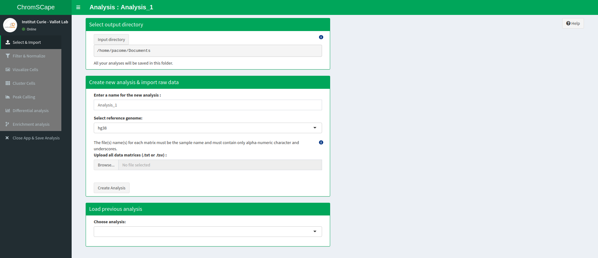
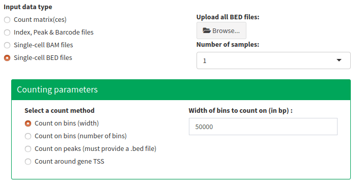
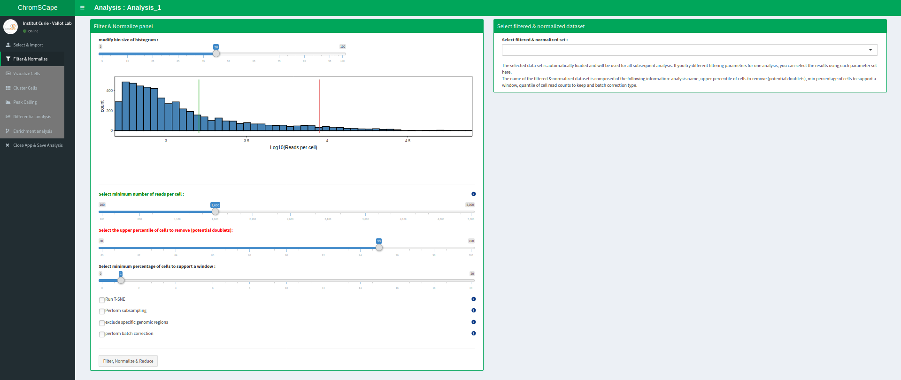
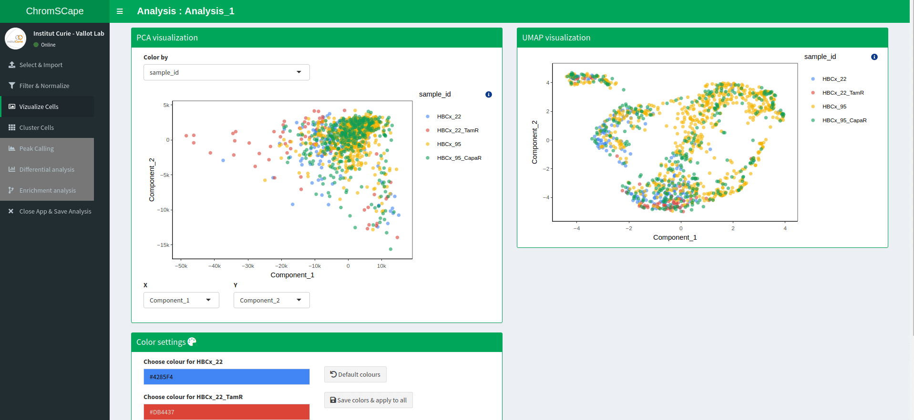
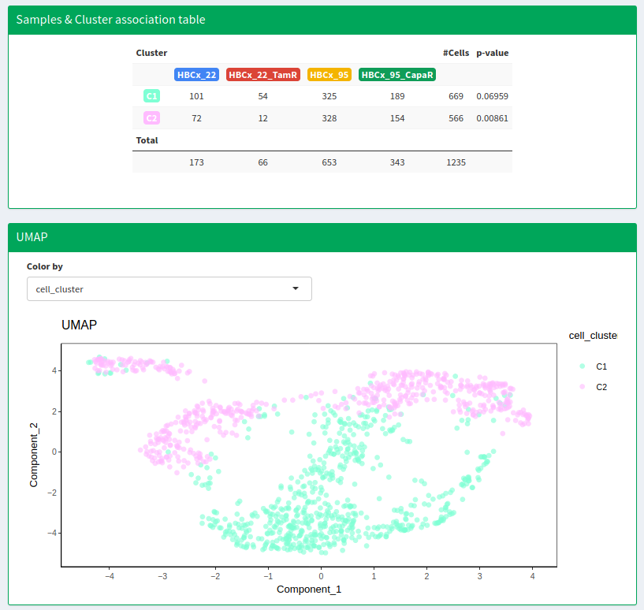
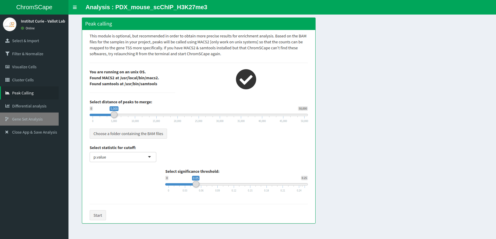
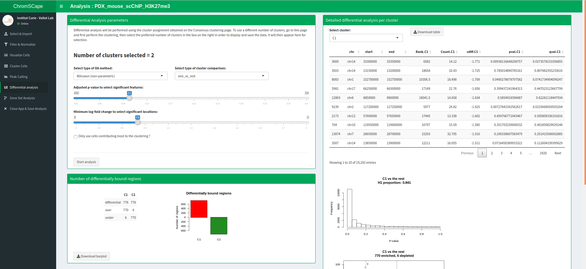
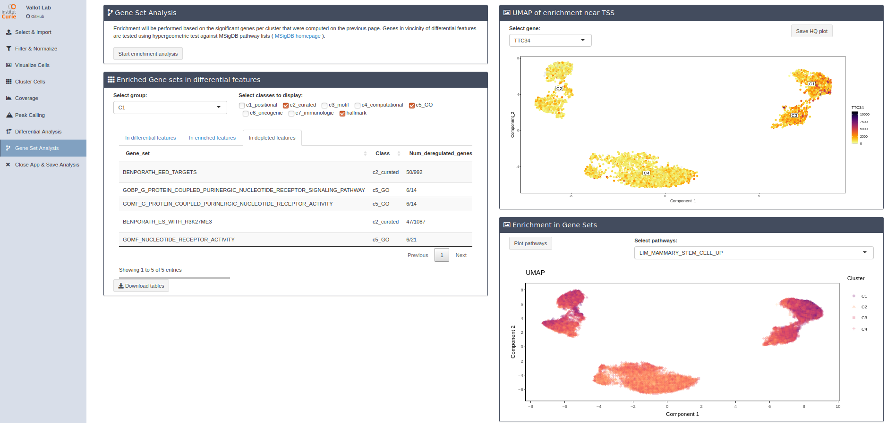

```{r setup, include = FALSE}
knitr::opts_chunk$set(
  collapse = TRUE,
  comment = "#>"
)
```


# Introduction

Chromatin modifications orchestrate the dynamic regulation of gene expression during development and in disease. Bulk approaches have characterized the wide repertoire of histone modifications across cell types, detailing their role in shaping cell identity. However, these population-based methods do not capture **cell-to-cell heterogeneity** of chromatin landscapes, limiting our appreciation of the role of chromatin in dynamic biological processes. Recent technological developments enable the mapping of histone marks at single-cell resolution, opening up perspectives to characterize the heterogeneity of chromatin marks in complex biological systems over time. Yet, existing tools used to analyze bulk histone modifications profiles are not fit for the low coverage and sparsity of single-cell epigenomic datasets.  
  
**ChromSCape** is a user-friendly interactive **Shiny/R application** that processes single-cell epigenomic data to assist the biological interpretation of chromatin landscapes within cell populations. **ChromSCape** analyses the distribution of repressive and active histone modifications as well as chromatin accessibility landscapes from single-cell datasets (*scATAC-seq, scChIP-seq, scCUT&TAG...*).
  
The goal of **ChromSCape** is to provide user a interactive interface to explore and run a **complete analyse** (*QC, preprocessing, analysis, interpretation*) on various single-cell epigenomic data. The application has multiple advantages:  

* No R knowledge is required
* Analyses persist on the user's computer, allowing for fast reloading of the analysis
* Parameters are highly customizable 
* Vizualisation at all steps
* Meant for multiple single cell epigenomic data
* Acceptance of raw files (BED, BAMs, .txt, ...) for feature counting
* Linking epigenomics with biological interpretation with Gene Set Analysis


# Quick Start

To launch the application simply run:

```{r, eval=F}
if (!requireNamespace("BiocManager", quietly = TRUE)){
  install.packages("BiocManager")
}
BiocManager::install("ChromSCape")
```

Load **ChromSCape**  

```{r, eval=T}
library(ChromSCape)
```

Launch the shiny application   

```{r, eval=F}
launchApp()
```

A browser should open with the application. If the browser doesn't open automatically, navigate to the displayed url, e.g.  "*Listening on http://127.0.0.1:5139*". The first time you'll open the application, you will be guided through a small tour of the application, that you can come back to any time you like by clicking the **Help** button on the upper right corner.  


# ChromSCape step by step

The user interface is organized by 'Tab' corresponding to specific 'step' of the analysis. In order to be able to access to each Tab you need to complete the previous steps. For example, before accessing the 'Filter & Normalize' Tab, you need to first complete the 'Select & Import' Tab.  

Each one of your project is named an 'Analysis' and is comprised of one raw dataset and additional objects that you have produced by going further into the analysis. A folder named '*ChromSCape_analyses*' which will contain all your Analysis is produced in the output directory when you create an Analysis for the first time. In this folder, each of your Analysis is a folder with the following organisation:

> ChromSCape_analyses/  
  ├── Analysis_1  
  │   ├── annotation.txt  
  │   ├── Filtering_Normalize_Reduce  
  │   │   └── Analysis_1_(...).RData  
  │   ├── correlation_clustering  
  │   │   └── Analysis_1_(...).RData  
  │   ├── Diff_Analysis_Gene_Sets  
  │   │   └── Analysis_1_(...).RData  
  │   └── scChIP_raw.RData  
>

  
The raw data is stored at the root of the folder, and at each main step ('Filtering & Normalization', 'Correlation Clustering' and 'Differential Analysis') the objects are saved. This enable you to close the application and later re-load your analysis without the need of re-doing all those steps. This also enable you to share your analysis with colleagues simply by copying your Analysis folder. 

*Note:*  The (...) in the saved objects contained the values of the parameters for an Analysis. If you try multiple parameter, each results will be saved this way and all trials will accessible in the future.


## Input files (before launching ChromSCape)

Various existing technologies allow to produce single-cell genome-wide epigenomic
datasets :  

  * scChIP-seq (Grosselin et al., 2019) scCUT&Tag (Kaya-Okur et al., 2019),
 scChIL-seq (Harada et al., 2019), scChIC-seq (Ku et al.,) reveal the distribution of histone marks (H3K27me3, H3K4me3) or transcription factors (RNA Polymerase 2,…) with single-cell resolution. 
  * scATAC-seq (Buenorostro et al., 2015) or sciATAC-seq (Cusanovitch et al., 2016) assess regions of open chromatin in single-cells
  * scDNA methylation profiling, scRRBS, scWGBS ...
<br>

   


<br>
After sequencing a single-cell epigenomic experiment, the raw sequencing files 
(.fastq) are demultiplexed, aligned against a reference genome to output different
kind of data depending on the technology.   
ChromSCape allows user to input a variety of different format. Depending on the
output of the data-engineering/pre-processing pipeline used, the signal can
be already *summarized into features* (**Count matrix**, **Peak-Index-Barcode** 
files) or stored directly in *raw format* (**single-cell BAM** or **single-cell BED** 
files).

Anyhow the format, ChromSCape needs signal to be summarized into features. 
If inputting *raw signal* (**scBAM** or **scBED**), the application lets user
summarize signal of each cells into various features:

 * **Genomic features** (extended region around TSS of genes, enhancers)
 * **Peaks** called on bulk or single-cell signal (BED file must be provided by the user)
 * **Genomic bins** (windows of constant length, e.g. 100kbp, 50kbp, 5kbp...)
 
Note that summarizing will take longer if using BAM files than BED files, and 
if the number of features is important (e.g. 5kbp bins, enhancers...).

### Count matrices files

Each sample should be contained into single-cell count matrix (features x cells) 
in tab-separated format (extension .txt or .tsv) or comma-separated format (.csv). 
The first column is genomic location in standard format (chr:start-end) and the next columns are
reads counted in each cells in the corresponding genomic feature. Note that the
first entry (row 1, column 1) must be empty. All files should be placed in the same folder.

If inputing only a single matrix regrouping different samples, the user can 
check the 'multiple sample' check box and specify a number of samples. ChromSCape
will automatically find the different samples based on the names of the cells, so
please make sure samples names are all quite different (e.g. K562_.., GM12878_..).

An example of such dataset is availablefor H3K27me3 mouse scChIP-seq of
paired PDX samples at: [PDX mouse cells H3K27me3 scChIP-seq matrices](https://ndownloader.figshare.com/files/22629317).
<br>

>
 	BC969404	BC893525	BC239068	BC073314
chr10:0-50000	0	0	0	0
chr10:50000-100000	0	0	0	0
chr10:100000-150000	0	0	0	0
...
>
  
<br>

### Peak-Index-Barcode files

This format regroups three files containing signal of all samples of one or multiple experiment:  

 * The **barcode file** contains one cell barcode per line and finish by '_barcode.txt' :

>
HBCx95_BC969404
HBCx95_BC893525
HBCx22_BC239068
HBCx22_BC073314
...
>
  
* The **peak file** contains feature location (usually peaks) must be in BED format 
and finish by '_peaks.bed': 

>
chr3	197959001	197961500
chr3	198080001	198081500
chr4	53001	55500
...
>
  
* The **index file** contains indexes of non-zero signal and finish by '_indexes.txt',
the first column is the index of peaks, the second column contains barcode index,
the last column contains the signal: 

>
459	1	1
461	1	1
556	1	2
>

<br>

### Single-cell BAM or BED files

Each BAM or BED (.bed or .bed.gz) file must be grouping signal of a single-cell, and all files
must be placed in the same folder. The signal will be summarized into either bins,
peaks, or around gene TSS depending on user choice.

An example of such dataset is publicly available for H3K27me3 single-cell CUT&TAG (Kaya-Okur et al., 2019)
 K562 and H1 cells at: [K562 H3K27me3 cells](https://www.ncbi.nlm.nih.gov/geo/download/?acc=GSE124680&format=file)
 and [K562 + H1 H3K27me3 cells](https://www.ncbi.nlm.nih.gov/geo/download/?acc=GSE129119&format=file). 
 All files need to be placed in the same folders, the BED files do not need to be
 unzipped.
<br>

### Alignment BAM files for Peak Calling (**optional**)

For the optional step of Peak Calling on cluster of cells found de novo, 
users have to input one BAM file per sample, placed in the same folder. The barcode
information of each read should be contained in a specific tag (XB, CB..) and correspond
to the column names of the corresponding count matrix.

<br>


>samtools view example_matrix.bam | head
NS500388:436:HNG5VAFXX:2:21311:26430:3816	89	chr10	3102405	255	51M	*	0	0	CTTGGTGTCTAGTGGATCTGCTGCAGTCTTCTGTTGTCAGTGCTAAATCAC	EEEEE/E6EEEAEEEEEEEEEEEEEEEEEEEEEEEEEEEEEEEEEEAAAAA	NH:i:1	HI:i:1	AS:i:50	nM:i:0	XS:i:2147483647	XD:Z:GATGACAAAG	XB:Z:BC969404
...
>

## Create & import a dataset

Once you have launched the application, you arrive on the "**Select & Import**". Here you
can selet an output directory, where your analyses will be saved. ChromSCape will 
automatically save the folder's location so that you don't have to select it each
time you connect.  

You must then name your analysis. The name shouldn't contain special characters (except
'_'). Choose either the Human (hg38) or Mouse (mm10) genome. This is used to annotate
your features with the closest genes TSS for the Gene Set Analysis. Browse your 
computer for one or multiple matrices that will be analyzed together. To select
multiple matrices, they must be placed in the same folder and then the user can select
multiples matrices with (Shift + Click) or (Ctrl + Click).   
Finally, clicking  on 'Create Analysis' will create an analysis & import the count matrices
in this analysis. This will create a folder named '*ChromSCape_analyses*' in the output 
directory you specified, inside which
another folder 'Your_analysis_name' is nested. If you create another analysis,
it will also be created under '*ChromSCape_analyses*'. 
If you already created an analysis in a previous section, selecting the same output
directory as you chose in the previous session will enable you to load your analysis.

<br>

  

  

### Summarizing features

Depending on what kind of data you are analyzing, you might want to summarized your
data on different features. For open/active chromatin measures, such as ATAC or 
ChIP against H3K4me3, we recommand to summarize signal into small bins of 5kbp to 
10kbp or to count aroung gene TSS. When counting around gene TSS, the default is to
take overlapping regions of 2,500bp around the gene TSS, but you might want to increase
this value for scATAC-seq if looking to retrieve enhancers open regions. For repressive
marks such as H3K27me3, we recommand summarizing into large bins of 50kbp to 100kbp, as 
those mark are known to accumulate into large domains.

### Recognition of samples

ChromSCape will recognize automatically to which sample/condition each cell belongs. In order
to do so, the names of the cells (e.g. names of the files for scBED/scBAM or
barcodes names for combined Index-Peaks-Barcode/count matrix) should explicitely
contains name of the samples/conditions.  

Example: if inputing two cell types, e.g. Jurkat and Ramos, names of the files/cells
should be something like : Jurkat_cell1.BED, Jurkat_cell2.BED, ..., Ramos_cell1.BED,
Ramos_cell2.BED.  

The more different the names of the samples/conditions are, the more easily ChromSCape
will classify correctly each cell. If having two samples with a similar name, users should 
manually change the names of the label. For example if having 'CMP' (common myeloid progenitors)
and 'GMP' (granulocytes myeloid progenitors) samples, change the name manually to
'commonMP' and 'granulocytesMP' respectively.

### Inputing BAM files

Inputting BAM files is the most demanding task in terms of ressource in the application,
despite the fact that the summarizing of features will take place in parallel. 
To give an example, for 1,287 single-cell BAM files, summarizing into 50kbp bins
takes 9 minutes to finish. Counting from BED files is way faster, therefore if
analyzing lots of cells in BAM format, users might consider running 'bamToBed'
command from BEDTools on each file beforehand.

## 2. Filter, Normalize & Reduce Dimensionality 

In order to efficiently remove outlier cells from the analysis, e.g. cells with excessively high or low coverage, the user sets a threshold on a minimum read count per cell and the upper percentile of cells to remove. The latter could correspond to doublets, e.g. two cells in one droplet, while lowly covered cells are not informative enough or may correspond to barcodes ligated to contaminant DNA or library artifacts. Regions not supported by a minimum user-defined percentage of cells that have a coverage greater than 1,000 reads are filtered out.   

Defaults parameters were chosen based on the analysis of multiple scChIP-seq datasets:  

 * A minimum coverage of 1,600 unique reads per cell
 * Filtering out the cells with the top 5% coverage
 * Keeping regions detected in at least 1 % of cells.
 
  
Post quality control filtering, the matrices are normalized by total read count and region size ([CPM normalization](https://haroldpimentel.wordpress.com/2014/05/08/what-the-fpkm-a-review-rna-seq-expression-units/).
At this step, the user can provide a list of genomic regions, in BED format, to exclude from the subsequent analysis, in cases of known copy number variation regions between cells for example.  
  
  
To reduce the dimensions of the normalized matrix for further analysis, PCA is applied to the matrix, with centering, and the 50 first PCs are kept for further analysis.

If you want to run t-SNE for vizualisation in addition to PC and UMAP, tick the 'Run T-SNE' checkbox. This might take some time to run, depending on the size of the dataset.  


For some large datasets (e.g. more than 15,000 cells) or unbalance datasets (i.e. number of cells per sample is very different), it might be a good option to first run with the subsampling option. To do so, tick the 'Perform subsampling' and select the maximum number of cells to subsample from each sample. The sampling is done without replacement.  


Users might want to remove specific loci from the analysis, e.g. repeat regions, known Copy Number Altered regions that might bias the analysis. To do so, tick the 'Exclude specific genomic regions' and browse for a BED file containing the regions to exclude.  


A batch correction option using mutual nearest neighbors ‘FastMNN’ function from [batchelor](https://www.bioconductor.org/packages/release/bioc/html/batchelor.html) is implemented to remove any known batch effect in the reduced feature space. To do so, tick the 'Perform batch correction', select the number of batches and add each sample to a batch.  


<br>

  


## Visualize cells in reduced dimensions 

The user can visualize the data after quality control in the PCA , t-SNE or UMAP reduced dimensional space. The PCA and t-SNE plots are a convenient way to check if cells form clusters in a way that was expected before any clustering method is applied. For instance, the user should verify whether the QC filtering steps and normalization procedure were efficient by checking the distribution of cells in PC1 and PC2 space. Cells should group independently of normalized coverage.   
  
Depending on wether you have ticked the 'Run T-SNE' checkbox in the previous Tab, you will see the T-SNE two dimensional plot. 

*Note:* You can change the colors of each samples, batch or cluster and the saved colors will be saved in the Analysis.

<br>

 

## Cluster cells

Using the first 50 first PCs of computed PCA as input, hierarchical clustering is performed, taking 1-Pearson’s correlation score as distance metric. The cell to cell correlation heatmap and dendogram describing the hierarchical clustering is represented in the left panel. 

To improve the stability of the clustering approaches and to remove from the analysis isolated cells that do not belong to any subgroup, cells displaying a Pearson’s pairwise correlation score below a threshold t with at least p % of cells can be filtered out. The correlation threshold t is calculated as a user-defined percentile of Pearson’s pairwise correlation scores for a randomized dataset (percentile is recommended to be set as the 99th percentile). To do so, open the "Filter lowly correlated cells" panel and click on "Filter & Save". This will filter any cells that are too rare to correlate with enough other cells and form stable clusters.  

To select a number of clusters, looking at the correlation heatmap and dendogram, choose a number in the 'Select Cluster Number' panel and click on 'Choose Cluster'.

If you are unsure of how many cluster to choose, you can run consensus clustering using Bioconductor's package [ConsensusClusterPlus](https://www.bioconductor.org/packages/release/bioc/html/ConsensusClusterPlus.html) package to determine what is the appropriate k-partition of the dataset into k clusters. To do so, it evaluates the stability of the clusters and computes item consensus score for each cell for each possible partition from k=2 to n. For each k, consensus partitions of the dataset are done on the basis of 1,000 resampling iterations (80% of cells sampled at each iteration) of hierarchical clustering, with Pearson's dissimilarity as the distance metric and Ward's method for linkage analysis. The optimal number of clusters is then chosen by the user; one option is to maximize intra-cluster correlation scores based on the graphics displayed on the ‘Consensus Clustering’ Tab after processing.  


If you ran consensus clustering, re-pick the cluster numbers in the 'Select Cluster Number' panel making sure you check the 'Use consensus' checkbox and re-click on 'Choose Cluster'.

Cell clusters can then be visualized in two dimensions with the t-SNE or UMAP plot.

*Note:* The correlation filtering and consensus clustering steps are optional as they need long runtime. You might want to proceed to Differential Analysis and Gene Set Analysis directly if you are confident in your choice of clusters.

<br>

 


<br>



## Peak Calling to refine bins to gene annotation

This step of the analysis is optional, but recommended for Gene Set Analysis if working on genomic bins in order to refine the peak annotation prior to enrichment analysis. To be able to run this module, some additional command line tools are required such as SAMtools, BEDTools and MACS2. Therefore, this step is only available for Linux and MacOS systems.  

You need to input BAM files for the samples (one separate BAM file per sample), with each read being labeled with the barcode ID in the 'XB' tag. ChromSCape merges all files and splits them again according to the previously determined clusters of cells (one separate BAM file per cluster). To do so, place all your BAM files in a folder and click on the 'Choose a folder containing the BAM files' button to browse for your folder. If some of the BAM files in the folder are not part of your analyis, remove them by pressing the write box and deleting them.    

You  can select significance threshold for peak detection (passed to MACS2) and merging distance for peaks (defaults to p-value=0.05 and peak merge distance to 5,000). This allows to identify peaks in close proximity (<1,000bp) to a gene transcription start site (TSS); these genes will be later used as input for the enrichment analysis.  
	
<br>

 

## Differential Analysis

To identify differentially enriched regions across single-cells for a given cluster, ChromSCape can perform 
1. A non-parametric two-sided Wilcoxon rank sum test comparing normalized counts from individual cells from one cluster versus all other cells, or cluster of choice, 
2. Or a parametric test comparing raw counts from individual cells, using the Bioconductor package [edgeR](https://bioconductor.org/packages/release/bioc/html/edgeR.html), based on the assumption that the data follows a negative-binomial distribution. We test for the null hypothesis that the distribution of normalized counts from the two compared groups have the same median, with a confidence interval 0.95. The calculated p-values are then corrected by the Benjamini-Hocheberg procedure.  
You can modify the log2 fold-change threshold and corrected p-value threshold for regions to be considered as significantly differentially enriched (default settings are a p-value and log2 fold-change thresholds respectively of 0.01 and 1).  

If you have specified batches to correct for batch effect, the differential analysis is done using the ‘pairwiseWilcox’ function from the Bioconductor package [scran](https://bioconductor.org/packages/release/bioc/html/scran.html) , setting the batch of origin as a ‘blocking level’ for each cell.



## Gene Sets Analysis


In this tab, using the refined annotation of peaks if available, the final step is to look for enriched gene sets of the MSigDB v5 database within differentially enriched regions (either enriched or depleted regions in the studied histone mark). Click on 'Start Enrichment Analysis' in order to apply hypergeometric tests to identify gene sets from the MSigDB v5 database over-represented within differentially enriched regions, correcting for multiple testing with the Benjamini-Hochberg procedure. Users can then visualize most significantly enriched or depleted gene sets corresponding to the epigenetic signatures of each cluster and download gene sets enrichment tables. 

The top 100 most significant differential regions, single-cell Epigenomic enrichment levels can be visualized overlaying read counts for each cell at selected genes onto a t-SNE plot (right panel).   




# Session information

```{r, eval=T}
sessionInfo()
```
